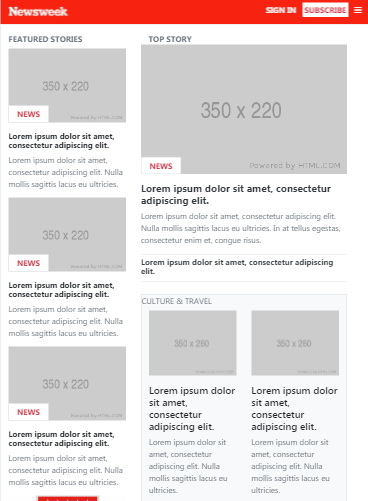
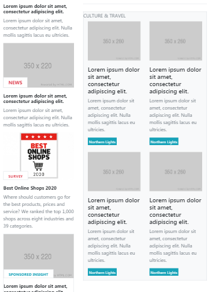
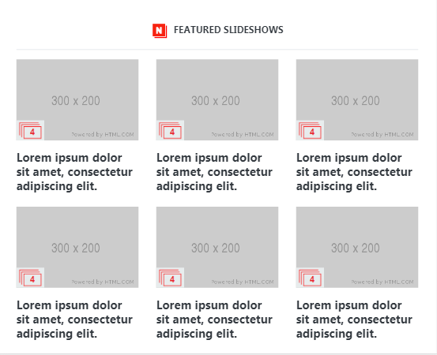

# Using Bootstrap

This is the sixth project of the Main HTML/CSS curriculum at [Microverse](https://www.microverse.org/) - @microverseinc
* The goal was to recreate the Nnewsweek's website
* The project was completed using Bootstrap

#### [Assignment link](https://www.theodinproject.com/courses/html5-and-css3/lessons/using-bootstrap)

#### [Live Version](https://raw.githack.com/flov3rh/using_bootstrap/features/index.html)

#### Screenshots

#### Authors

* [@Flover](https://github.com/flov3rh)

